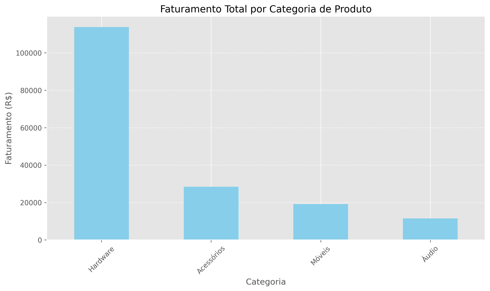
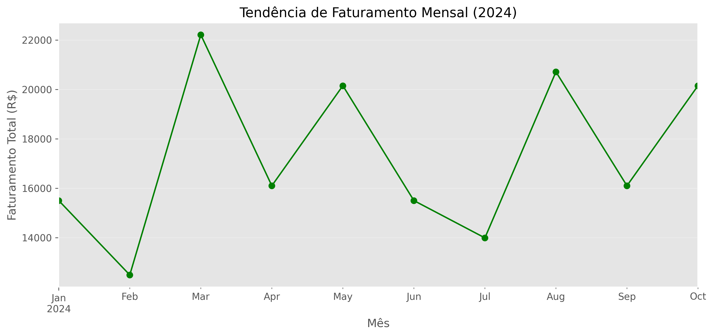

Analisando Tendências de Tecnologia com Python

Este repositório apresenta um projeto de análise de dados focado no comportamento de vendas de uma operação de varejo fictícia. O desenvolvimento prioriza a modularização do código, a automação de saídas gráficas e a organização de diretórios seguindo padrões de mercado.

1. Objetivo

O projeto visa extrair insights sobre o faturamento bruto e volume de transações para identificar produtos de maior rentabilidade e sazonalidade de vendas, auxiliando na tomada de decisão estratégica.

2. Tecnologias e Ferramentas

        Ambiente de Desenvolvimento: Linux Mint.

        Linguagem: Python 3.12.

        Bibliotecas de Dados: Pandas e Numpy para processamento e limpeza.

        Visualização: Matplotlib para geração de dashboards estáticos.

        Integração: Jupytext para sincronização entre notebooks (.ipynb) e scripts (.py).

3. Estrutura de Diretórios

        meu-projeto-dados/
        ├── data/
        │   └── vendas.csv          # Base de dados bruta em formato CSV
        ├── output/
        │   └── *.png               # Gráficos exportados automaticamente
        ├── src/
        │   ├── dashboard.ipynb     # Notebook para análise exploratória e visualização
        │   └── dashboard.py        # Script sincronizado para execução via terminal
        ├── .gitignore              # Definição de arquivos ignorados pelo versionamento
        ├── README.md               # Documentação do projeto
        └── requirements.txt        # Lista de dependências do projeto

4. Funcionalidades Implementadas

    Processamento de Dados: Cálculo automático de faturamento e agregação por categoria.

    Visualização: Geração de gráficos de barras para faturamento por setor e gráficos de linha para análise de tendência temporal.

    Automação: Rotina para criação automática do diretório de saída (output) e salvamento de imagens em alta resolução (300 DPI).

5. Instruções de Instalação e Execução

5.1 Configuração do Ambiente

Recomenda-se a utilização de um ambiente virtual para isolamento das dependências:
Bash

Clone o repositório

        git clone https://github.com/diego-mansija/meu-projeto-dados.git

Criação e ativação do ambiente virtual

        python3 -m venv .venv
        source .venv/bin/activate

Atualização do gerenciador de pacotes e instalação das dependências

        python -m pip install --upgrade pip
        pip install -r requirements.txt

5.2 Execução das Análises

Para executar o processamento e gerar os gráficos na pasta output, utilize o script disponível em src/:

        cd src
        python3 analise.py

Alternativamente, o projeto pode ser explorado de forma interativa através do VS Code abrindo o arquivo src/analise.ipynb.

6. Resultados e Insights

Abaixo, as visualizações geradas pelo projeto demonstram o desempenho das categorias e a evolução do faturamento ao longo do período analisado.

        6.1 Faturamento por Categoria

        6.2 Tendência de Faturamento Mensal
